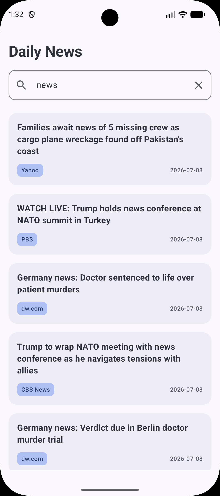

# 📰 News App

A modern Android News application built with Kotlin and Jetpack Compose.

## ✨ Features

- 🔍 Search news articles
- ♾️ Infinite scrolling (Pagination)
- 📰 Latest news
- 📄 News details
- ⚡ Fast and responsive UI
- ❌ Error handling
- 📭 Empty state support

## 📱 Screenshots

Home

<p align="center">
  
</p>

Details

<p align="center">
  
</p>

## 🛠 Tech Stack

- Kotlin
- Jetpack Compose
- MVVM
- Clean Architecture
- Retrofit
- Coroutines
- StateFlow
- Navigation Compose
- Coil

## 📂 Architecture

```
Presentation
│
├── ViewModel
├── Screen
└── Components

Domain
│
├── Models
└── Repository

Data
│
├── Remote
├── DTO
└── Repository
```

## 🌐 API

This project uses the [Free News API](https://www.freenewsapi.io/).

## 🚀 Getting Started

1. Clone the repository

```bash
git clone https://github.com/YOUR_USERNAME/NewsApp.git
```

2. Create a `local.properties` file (or edit the existing one) and add your API key:

```properties
NEWS_API_KEY=YOUR_API_KEY
```

3. Build and run the project.

## 📄 License

This project is licensed under the MIT License.
